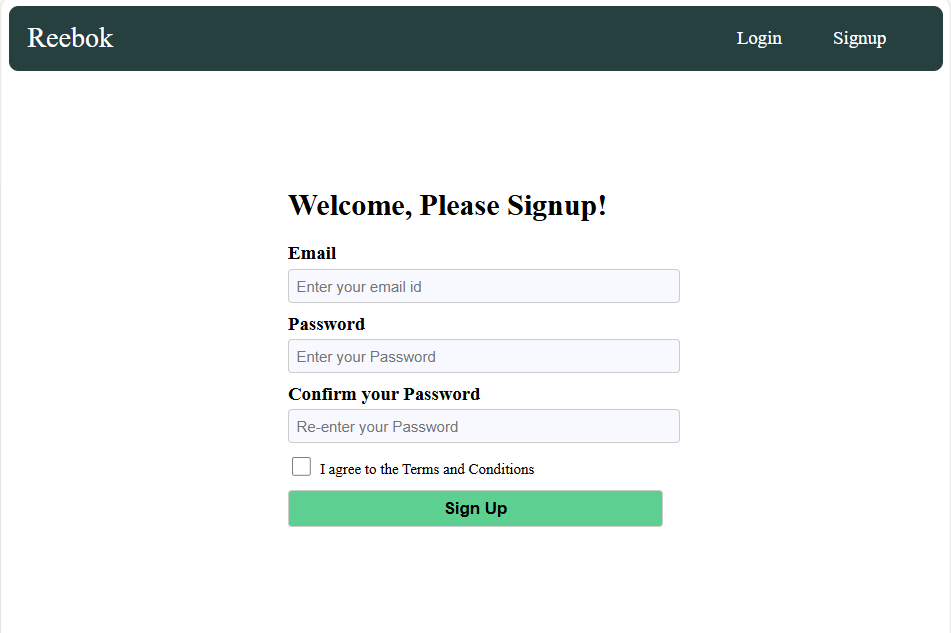
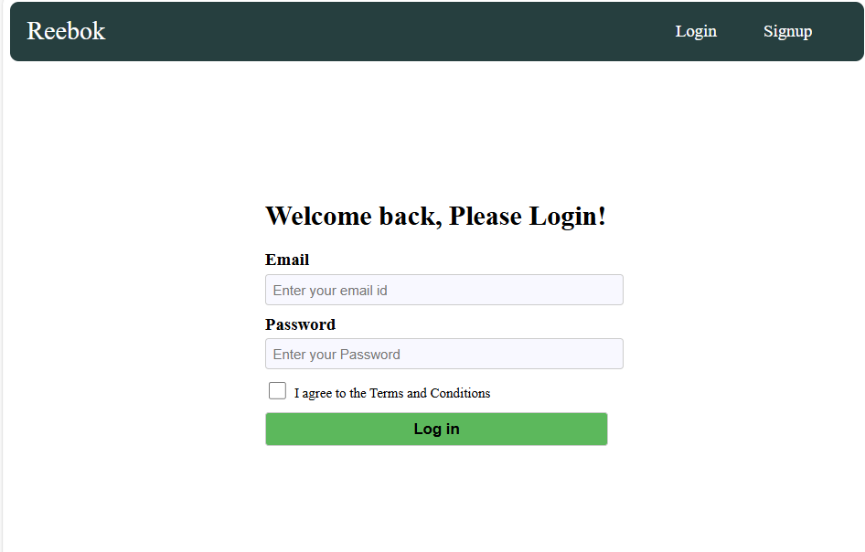
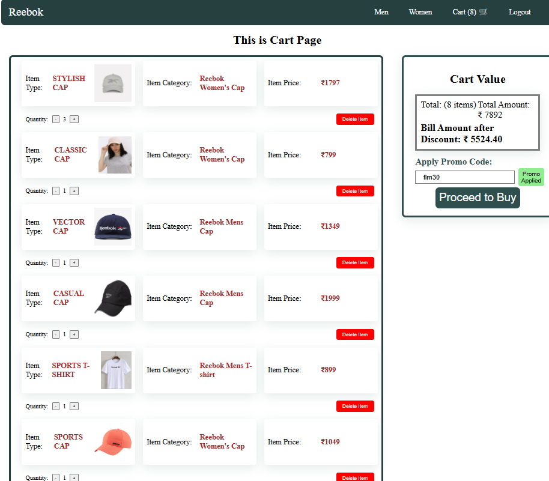
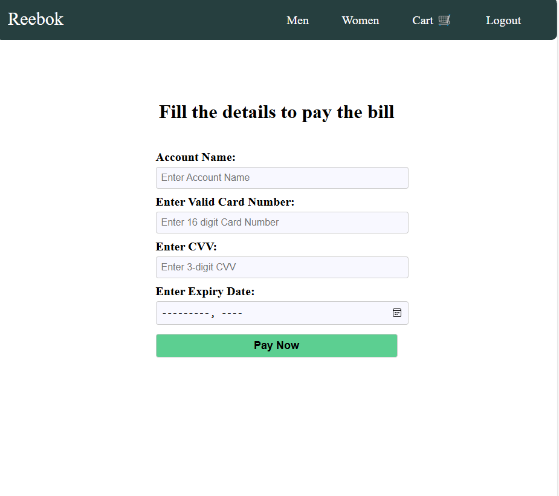
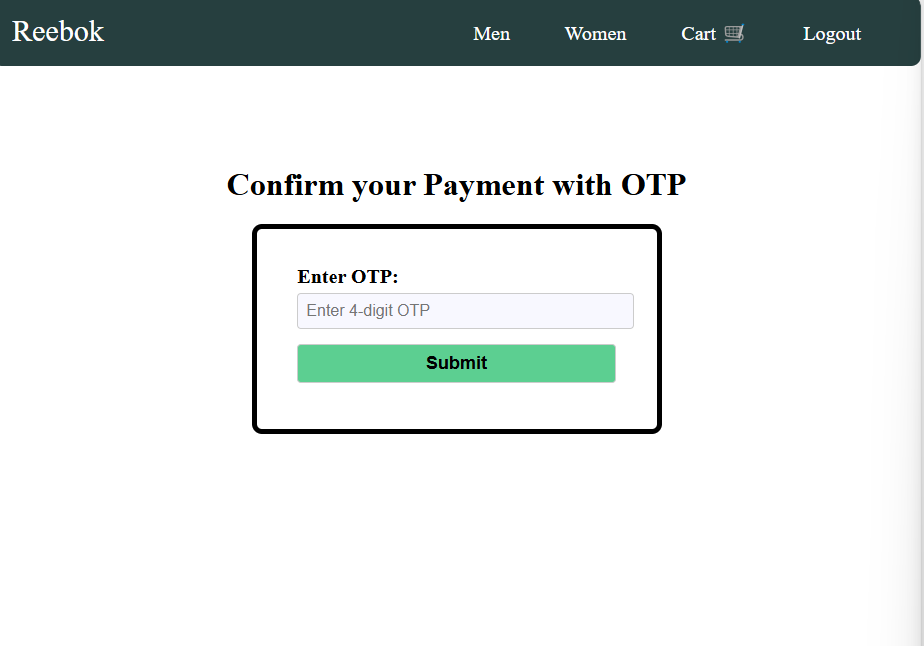

# Reebok-Application

This repository is an E-commerce Web Application of Reebok fashion that has features of complete shopping from Login/Sing up to Payment

## This E-Commerce Project has the following Features

### 1. Sign Up page:

User can Sign Up with his/her email id and password.

- Password has be entered twice to confirm
- Existing users cannot Sing up. They are redirected to Login Page
  

### 2. Login Page

Once User has created his/her account, they can login with their credentials.

- New Users Cannot Login Directly, They are re-directed to Sign Up Page with alert message.

### 3. Home Page

Once user is Logged In, They are redirected to Home Page.

- HomePage has a Banner and Navigation Links:
- **Reebok**
- **Men**
- **Women**
- **Cart**
- **Logout**

### 4. Men Page

This Page is all about Mens fashion

- It has Shopping items based on Categories like Caps, Top wear, Bottom wear, Foot wear.
- Every Item has an product image, Category name, item name, price and a add to cart button
- When Add to Cart button is clicked, Go to Cart button will be enabled. On clicking it, it will redirect to cart Page.
  
- Results can be filtered based on Category
  
- Results can be sorted based on Price and Name
  

### 5. Women Page

This Page is all about Womens Page and has all features that Mens Page have

### 6. Cart Page

This page shows the list of items that are added to cart.

It has the following features:

- It shows all the items that are pushed to cart by selecting add to cart.
- It has each item with name, type and price
- It has an option to set the quantity, Based on the quantity, the price is dynamically updated.
- On the right, There is a cart value, which shows the final bill of all the items and total no.of items
- It also has an Option to avail the Promo code which works for given value, Then Bill will be generated dynamically after discount.
- It also has a Proceed to Buy option to go for a payment.
  

### 7. Payment Page

This Page accepts payment based on the validating the given values except for Account Name.

- On clicking the pay Now button, it will redirect to OTP Page

### 8. OTP Page

This page validated the OTP message that checks the hardcoded value.

- Once OTP is verified, It gives an alert with Success Message and Redirects to Home Page.
- The user can also has Log Out option which takes them to the Login / Sign Up Page.

